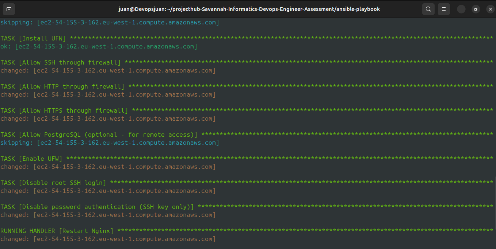

# Ubuntu EC2 Configuration with Ansible

## Overview
This Ansible playbook automates the configuration of an Ubuntu EC2 instance with PostgreSQL database, Nginx web server, and secure file management.

## Features
- ✅ Creates `devops` user and group with sudo access
- ✅ Configures SSH key-based authentication
- ✅ Copies configuration file to `/opt/` with restricted permissions (read/write for devops group only)
- ✅ Installs latest PostgreSQL database
- ✅ Installs and configures Nginx web server
- ✅ Configures UFW firewall
- ✅ Hardens SSH security (disables root login and password authentication)

## Prerequisites

### Local Machine Requirements
- Ansible installed (version 2.9 or higher)
- SSH access to EC2 instance
- EC2 SSH key (.pem file)

### EC2 Instance Requirements
- Ubuntu Server (18.04, 20.04, or 22.04)
- Security Group configured with:
  - Port 22 (SSH) - from your IP
  - Port 80 (HTTP) - from anywhere (0.0.0.0/0)
  - Port 443 (HTTPS) - from anywhere (optional)

**Screenshot: EC2 Security Group Configuration**

*Note: Ensure your security group allows the required ports*

## Project Structure
```
.
├── vm_config_playbook.yml    # Main Ansible playbook
├── hosts.ini                  # Inventory file with EC2 details
├── config.txt                 # Sample configuration file to deploy
└── README.md                  # This file
```

## Setup Instructions

### 1. Clone or Download the Project
```bash
git clone <your-repo-url>
cd <project-directory>
```

### 2. Configure Inventory File
Edit `hosts.ini` with your EC2 instance details:

```ini
[ec2_servers]
ec2-xx-xx-xx-xx.compute-1.amazonaws.com ansible_user=ubuntu ansible_ssh_private_key_file=~/.ssh/your-key.pem

[ec2_servers:vars]
ansible_python_interpreter=/usr/bin/python3
```

Replace:
- `ec2-xx-xx-xx-xx.compute-1.amazonaws.com` with your EC2 public DNS/IP
- `~/.ssh/your-key.pem` with the path to your SSH key

### 3. Set Correct Permissions on SSH Key
```bash
chmod 400 ~/.ssh/your-key.pem
```

### 4. Create Sample Configuration File
```bash
echo "Sample DevOps Configuration File" > config.txt
```

### 5. Test Connectivity
```bash
ansible -i hosts.ini all -m ping
```

Expected output:
```
ec2-xx-xx-xx-xx.compute-1.amazonaws.com | SUCCESS => {
    "changed": false,
    "ping": "pong"
}
```

## Running the Playbook

### Execute the Playbook
```bash
ansible-playbook -i hosts.ini vm_config_playbook.yml
```

**Screenshot: Playbook Execution Start**


**Screenshot: Playbook Execution in Progress**




**Screenshot: Playbook Execution Complete**


### Dry Run (Check Mode)
To see what changes would be made without applying them:
```bash
ansible-playbook -i hosts.ini vm_config_playbook.yml --check
```

### Verbose Output
For detailed execution information:
```bash
ansible-playbook -i hosts.ini vm_config_playbook.yml -v
# or -vv, -vvv for more verbosity
```

## Verification

### 1. Verify File Permissions
```bash
ssh -i ~/.ssh/your-key.pem ubuntu@your-ec2-ip
ls -l /opt/config.txt
```

Expected output:
```
-rw-rw---- 1 root devops 45 Oct 03 10:30 /opt/config.txt
```

**Screenshot: File Permissions Verification**


### 2. Verify PostgreSQL Installation
```bash
sudo systemctl status postgresql
psql --version
```

**Screenshot: PostgreSQL Status**


### 3. Verify Nginx Installation
```bash
sudo systemctl status nginx
curl http://your-ec2-ip
```

You should see the welcome page in your browser at `http://your-ec2-ip`

**Screenshot: Nginx Service Status**


### 4. Verify devops User
```bash
# Check user exists
id devops

# Test SSH access as devops user
ssh -i ~/.ssh/your-key.pem devops@your-ec2-ip

# Verify sudo access
sudo whoami  # Should return 'root'
```

### 5. Verify File Access Permissions
```bash
# As devops user
sudo su - devops
cat /opt/config.txt  # Should work
echo "test" >> /opt/config.txt  # Should work
exit

# As regular user (should fail)
cat /opt/config.txt  # Permission denied
```

## Playbook Tasks Breakdown

| Task | Description |
|------|-------------|
| System Updates | Updates apt cache and upgrades packages |
| User Management | Creates devops user and group |
| SSH Configuration | Sets up SSH keys and sudo access |
| File Transfer | Copies config.txt with proper permissions (0660) |
| PostgreSQL | Installs and starts PostgreSQL service |
| Nginx | Installs, configures, and starts Nginx |
| Firewall | Configures UFW with necessary ports |
| Security Hardening | Disables root login and password authentication |

## Configuration Variables

The playbook uses these variables (defined in the `vars` section):

```yaml
devops_group: devops              # Group name for file access
devops_user: devops               # Username for SSH and sudo
config_file_src: "./config.txt"   # Local file to copy
config_file_dest: "/opt/config.txt"  # Remote destination
web_server: nginx                 # Web server choice (nginx/apache)
```

You can modify these in the playbook or override them at runtime:
```bash
ansible-playbook -i hosts.ini vm_config_playbook.yml -e "web_server=apache"
```

## Troubleshooting

### Issue: SSH Connection Refused
**Solution:** Check EC2 Security Group allows SSH (port 22) from your IP

### Issue: Permission Denied (publickey)
**Solution:** 
```bash
chmod 400 ~/.ssh/your-key.pem
# Verify key path in hosts.ini is correct
```

### Issue: Ansible Module Not Found
**Solution:**
```bash
pip install ansible
# or
sudo apt install ansible
```

### Issue: PostgreSQL Not Starting
**Solution:**
```bash
ssh -i ~/.ssh/your-key.pem ubuntu@your-ec2-ip
sudo systemctl status postgresql
sudo journalctl -u postgresql -n 50
```

### Issue: Can't Access Nginx from Browser
**Solution:**
- Check EC2 Security Group allows HTTP (port 80)
- Verify Nginx is running: `sudo systemctl status nginx`
- Check UFW: `sudo ufw status`

## Security Considerations

1. **SSH Keys:** Never commit `.pem` files to version control
2. **Root Access:** Root SSH login is disabled by this playbook
3. **Password Auth:** Password authentication is disabled (key-based only)
4. **File Permissions:** config.txt is accessible only to devops group (0660)
5. **Firewall:** UFW is enabled with only necessary ports open

## Maintenance

### Update PostgreSQL
```bash
ansible -i hosts.ini all -m apt -a "name=postgresql state=latest" -b
```

### Restart Services
```bash
# Restart Nginx
ansible -i hosts.ini all -m systemd -a "name=nginx state=restarted" -b

# Restart PostgreSQL
ansible -i hosts.ini all -m systemd -a "name=postgresql state=restarted" -b
```

### Add Users to devops Group
```bash
ansible -i hosts.ini all -m user -a "name=newuser groups=devops append=yes" -b
```

## Author
Juan

