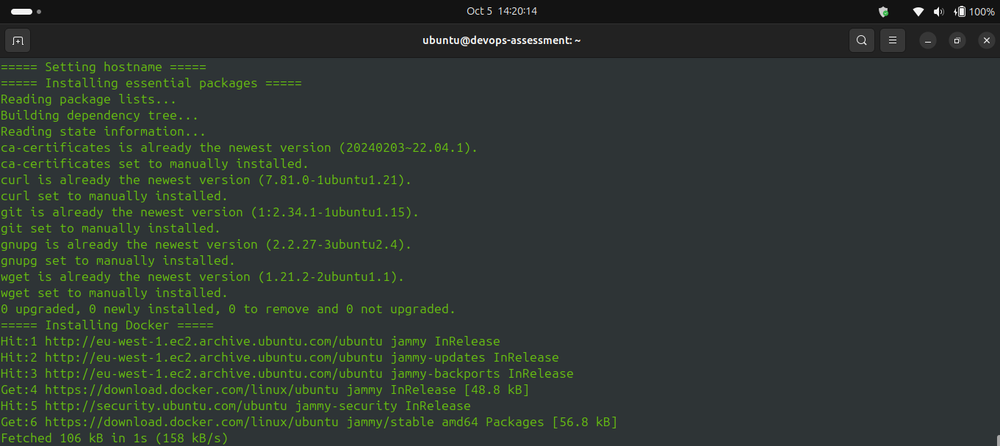
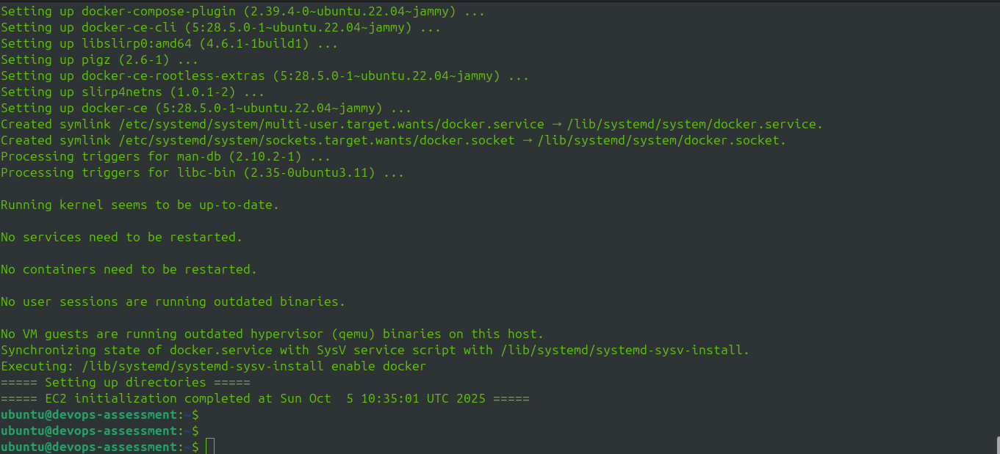

# Infrastructure as Code with Terraform

## Overview
This Terraform configuration deploys a complete AWS infrastructure stack as per the assessment requirements.

## Assessment Requirements

### ✅ Task Completion
- [x] Virtual machine instance deployed
- [x] Networking components (VPC, subnets) configured
- [x] Security configurations (HTTP/HTTPS traffic allowed)
- [x] Static IP address assigned to VM

## Infrastructure Components

### Virtual Machine
- **EC2 Instance**: Ubuntu server with automated initialization via user_data script
- **Instance Type**: t3.medium (configurable)
- **Storage**: 50GB root volume
- **User Data**: Installs Docker, creates application directories, configures devops group

**User Data Script Features:**
- System package updates
- Docker CE installation and configuration
- DevOps group creation
- Application directories setup (`/opt/app`, `/opt/monitoring`)
- Comprehensive logging to `/var/log/user-data.log`

### Networking Components
- **VPC**: Custom Virtual Private Cloud with dedicated network space
- **Subnet**: Public subnet with internet connectivity
- **Internet Gateway**: Enables external network access
- **Route Table**: Configured for public internet routing

### Security Configurations
- **Security Group** with inbound rules:
  - **SSH (22)** - Restricted to specific IP addresses (configurable via `ssh_allowed_ips`)
  - **HTTP (80)** - Allow from anywhere (0.0.0.0/0)
  - **HTTPS (443)** - Allow from anywhere (0.0.0.0/0)
  - **Application Port (8080)** - Allow from anywhere for health checks
  - **Prometheus (9090)** - Configurable access (via `monitoring_allowed_ips`)
  - **Grafana (3000)** - Configurable access (via `monitoring_allowed_ips`)
- **Outbound rules**: Allow all traffic
- **SSH Key**: Uses provided public key for authentication (no password access)

### Static IP Address
- **Elastic IP**: Permanent public IP address attached to EC2 instance
- Ensures consistent addressing even after instance restarts

### State Management
- **S3 Bucket**: Remote state storage
- **DynamoDB Table**: State locking for concurrent operation safety

## Project Structure
```
infrastructure/
├── main.tf                      # Main infrastructure configuration
├── variables.tf                 # Input variable definitions
├── outputs.tf                   # Output value definitions
├── terraform.tfvars.example     # Example variable values
├── user_data.sh                 # EC2 initialization script
├── terraform-plan-output.txt    # Execution plan output
├── terraform-apply-output.txt   # Deployment results
└── screenshots/                 # Infrastructure verification
```

## Prerequisites
- **Terraform** >= 1.0 installed
- **AWS CLI** configured with valid credentials
- **AWS Account** with appropriate permissions
- **SSH Public Key** (e.g., from `ssh-keygen -t rsa -b 4096`)

## Configuration

### Step 1: Prepare Variables
```bash
cp terraform.tfvars.example terraform.tfvars
```

Edit `terraform.tfvars` with your values:
```hcl
# AWS Configuration
aws_region  = "eu-west-1"
environment = "production"
owner       = "YourName"

# Project Settings
project_name = "devops-assessment"

# Network Configuration
vpc_cidr           = "10.0.0.0/16"
public_subnet_cidr = "10.0.1.0/24"

# EC2 Instance Configuration
instance_type    = "t3.medium"
root_volume_size = 50

# SSH Configuration
ssh_public_key = "your-ssh-public-key"
ssh_allowed_ips = ["your.ip.address/32"]

# Monitoring (optional)
monitoring_allowed_ips = ["0.0.0.0/0"]
```

### Step 2: Initialize
```bash
terraform init
```

This downloads the AWS provider and configures the remote backend.

**Remote State Backend:**


*S3 bucket stores the Terraform state file*


*DynamoDB table prevents concurrent state modifications*

## Deployment

### Step 1: Create Execution Plan
```bash
terraform plan -out=tfplan
```

This generates an execution plan showing all resources to be created.

📄 **Complete plan output:** [terraform-plan-output.txt](./terraform-plan-output.txt)

### Step 2: Apply Configuration
```bash
terraform apply tfplan
```

This deploys all infrastructure resources to AWS.

📄 **Complete deployment log:** [terraform-apply-output.txt](./terraform-apply-output.txt)

### Step 3: Retrieve Outputs
```bash
terraform output
```

**Example outputs:**
```
vpc_id              = "vpc-0123456789abcdef"
subnet_id           = "subnet-0123456789abcdef"
instance_id         = "i-0123456789abcdef"
instance_public_ip  = "54.123.45.67"
elastic_ip          = "54.123.45.67"
security_group_id   = "sg-0123456789abcdef"
```

## Verification

### 1. VPC and Networking Components

*VPC created with proper CIDR block and networking components*

**Verify via CLI:**
```bash
aws ec2 describe-vpcs --filters "Name=tag:Name,Values=*savannah*"
```

### 2. SSH Key Pair

*SSH key pair created and registered in AWS*

**Verify via CLI:**
```bash
aws ec2 describe-key-pairs --key-names devops-assessment
```

### 3. Virtual Machine Instance

*EC2 instance successfully deployed and running*

**Verify via CLI:**
```bash
aws ec2 describe-instances --instance-ids $(terraform output -raw instance_id)
```

### 4. Static IP Address (Elastic IP)

*Elastic IP allocated and associated with EC2 instance*

**Verify via CLI:**
```bash
aws ec2 describe-addresses
```

### 5. Security Configurations

*Inbound rules: SSH (22), HTTP (80), HTTPS (443), Application (8080), Prometheus (9090), Grafana (3000)*


*Outbound rules: Allow all traffic*

**Verify via CLI:**
```bash
aws ec2 describe-security-groups --group-ids $(terraform output -raw security_group_id)
```

**Port Summary:**
- Port 22: SSH (restricted to your IP)
- Port 80: HTTP (public)
- Port 443: HTTPS (public)
- Port 8080: Application health checks (public)
- Port 9090: Prometheus monitoring (configurable)
- Port 3000: Grafana dashboard (configurable)

### 6. SSH Connectivity

*Successful SSH connection to the EC2 instance*

**Connect via SSH:**
```bash
ssh -i ~/.ssh/devops-assessment ubuntu@$(terraform output -raw elastic_ip)
```

### 7. User Data Script Execution

The user_data script automatically runs on instance launch and sets up the environment.


*Verification that user_data script executed successfully*


*User data execution logs showing system updates and Docker installation*


*Continuation of user data logs*


*Final user data logs showing completion*

**Verify User Data Execution:**
```bash
# Check user data log
cat /var/log/user-data.log

# Verify Docker installation
docker --version
docker ps

# Check created directories
ls -la /opt/app
ls -la /opt/monitoring

# Verify devops group
getent group devops

# Check if ubuntu user is in docker group
groups ubuntu
```

## Resource Dependencies

Terraform automatically manages resource dependencies in the correct order:

```
1. VPC
   ├── 2. Subnet
   ├── 3. Internet Gateway
   └── 4. Route Table
       └── 5. Route Table Association
           └── 6. Security Group
               └── 7. EC2 Instance
                   └── 8. Elastic IP Association
```

**Dependency Handling:**
- All resources created in proper sequence
- Terraform waits for dependencies before creating dependent resources
- Automatic rollback on failure
- Parallel resource creation where possible

## Evaluation Criteria Met

### ✅ Correct IaC Script
- Clean, modular Terraform configuration
- Proper use of variables and outputs
- Following Terraform best practices
- Resource naming conventions

### ✅ Successful Resource Deployment
- All resources created successfully
- Infrastructure fully functional
- Services accessible as expected
- Screenshots provided as evidence

### ✅ Proper Handling of Dependencies
- Implicit dependencies through resource references
- Correct creation order maintained
- No manual dependency management needed
- Terraform graph validates dependency chain

## State Management

### View Current State
```bash
terraform state list
```

### Inspect Specific Resources
```bash
terraform state show aws_instance.web_server
terraform state show aws_eip.static_ip
```

### Refresh State
```bash
terraform refresh
```

## Cleanup

To destroy all created resources:

```bash
terraform destroy
```

**⚠️ Warning:** This permanently deletes all infrastructure components.

## Useful Commands

```bash
# Validate syntax
terraform validate

# Format code
terraform fmt

# Show current state
terraform show

# List all resources
terraform state list

# Get specific output
terraform output instance_public_ip
```